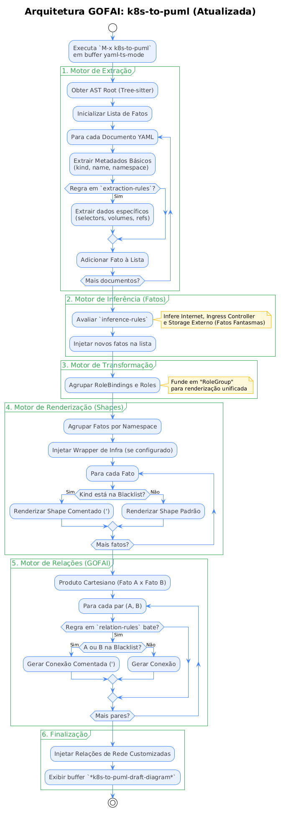

# k8s-to-puml


**k8s-to-puml** is a deterministic, rule-based Emacs package that generates PlantUML diagrams directly from Kubernetes YAML manifests. 

By leveraging Emacs' built-in Tree-sitter capabilities (`yaml-ts-mode`) and a Good Old-Fashioned AI (GOFAI) architecture, it parses your infrastructure as code and infers relationships, external dependencies, and architectural topologies without relying on external APIs or non-deterministic LLMs.

---

## Architecture: The GOFAI Engine

The core philosophy of `k8s-to-puml` is rooted in the KISS (Keep It Simple, Stupid) and Suckless principles. Instead of hardcoding complex parsing logic, the package operates as a declarative inference engine.



The pipeline consists of the following deterministic stages:

1. **Extraction Engine**: Uses Tree-sitter to parse the YAML Abstract Syntax Tree (AST). It consults a declarative knowledge base (`k8s-to-puml-extraction-rules`) to extract relevant "facts" (e.g., resource kinds, names, namespaces, selectors, volume mounts) into an association list (alist).
2. **Inference Engine (Facts)**: Evaluates the extracted facts against `k8s-to-puml-inference-rules`. If certain conditions are met (e.g., the presence of an `Ingress` resource), it dynamically injects "dummy facts" into the knowledge base, such as external Storage nodes, Internet clouds, or Ingress Controllers.
3. **Transformation Engine**: Processes the facts to group logically cohesive resources. For instance, it merges `RoleBinding` and `Role` facts into a unified `RoleGroup` for cleaner rendering.
4. **Rendering Engine (Shapes)**: Groups the facts by Kubernetes Namespace and generates the PlantUML nodes. It supports blacklisting (commenting out specific resources) and can wrap the entire cluster within a custom cloud infrastructure frame.
5. **Inference Engine (Relations)**: Executes a Cartesian product across all facts (Fact A × Fact B). It evaluates each pair against `k8s-to-puml-relation-rules`. If the predicate evaluates to true (e.g., a Deployment's volume name matches a PVC's claim name), the connection is drawn.

---

## Prerequisites

- **Emacs 29.1** or higher (compiled with Tree-sitter support).
- `yaml-ts-mode` (built-in, requires the YAML tree-sitter grammar).
- `plantuml-mode` (optional, but highly recommended for viewing the generated diagrams).

---

## Installation

Currently, `k8s-to-puml` is in active development and should be installed manually. (Availability via MELPA will be announced in the future).

1. Clone the repository or download the `k8s-to-puml.el` file.
2. Place the file in your Emacs `load-path` (e.g., `~/.emacs.d/lisp/`).
3. Add the following to your `init.el` or `.emacs`:

```elisp
(add-to-list 'load-path (expand-file-name "~/.emacs.d/lisp/"))
(require 'k8s-to-puml)
```

---

## Usage

While `k8s-to-puml` can parse any standalone Kubernetes YAML file, it is designed to shine when analyzing the complete topological state of a project. The recommended workflow involves generating the full manifest stack (e.g., via Kustomize or Helm) directly into an Emacs buffer.

The most idiomatic way to achieve this is by leveraging Emacs' `eshell` and its native buffer redirection capabilities:

1. Open `M-x eshell`.
2. Navigate to your project's environment overlay:
   ```
   $ cd project/kustomize/overlay/environment
   ```
3. Run `kustomize build` and redirect the standard output directly into a new Emacs buffer (e.g., `*kustomize-output*`):
   ```
   $ kustomize build . >>> #<buffer /kustomize-output/>
   ```
4. Switch to the newly created buffer:
   `C-x b *kustomize-output* RET`
5. Enable the required Tree-sitter mode:
   `M-x yaml-ts-mode`
6. Execute the generator:
   `M-x k8s-to-puml`

A new buffer named `*k8s-to-puml-draft-diagram*` will open containing the generated PlantUML code, representing the entire architecture of your Kustomize build. If `plantuml-mode` is installed, simply press `C-c C-c` to render the diagram.

---

## Basic Customization

The package is highly customizable via the Emacs `customize-group` interface (`M-x customize-group RET k8s-to-puml RET`) or programmatically via `setq` in your `init.el`.

### Blacklisting Resources

You can instruct the engine to extract and process certain resources but comment them out in the final PlantUML code. This is useful for hiding boilerplate resources like `ServiceAccount` or `Secret` while keeping their relationships intact (which will also be commented out).

```elisp
;; Ignore a single kind
(setq k8s-to-puml-ignored-kinds '("ServiceAccount"))

;; Or ignore multiple kinds
(setq k8s-to-puml-ignored-kinds '("ServiceAccount" "Secret" "Role"))
```

### Infrastructure Wrappers (Cloud / On-Premise)

By default, the Kubernetes cluster is rendered as an isolated node. You can define custom PlantUML strings to wrap the cluster in your specific cloud provider (e.g., OCI, AWS, Azure) or on-premise infrastructure, and route external traffic or storage accordingly.

```elisp
(setq k8s-to-puml-plantuml-includes "!include <office/Concepts/firewall>\n!include <office/Sites/site_collection>"
      
      ;; Opens the infrastructure frame and defines external nodes
      k8s-to-puml-infra-wrapper-open "frame \"OCI\" {\n  artifact \"OCI FSS\" as fss\n  rectangle \"<$firewall>\\nFortiweb\" as Fortiweb\n  rectangle \"<$site_collection>\\nOCI LB\" as LB"
      
      ;; Overrides the default Internet-to-Cluster route
      k8s-to-puml-infra-network-relations "internet --(0 Fortiweb : traffic\nFortiweb 0)-right-(0 LB\nLB 0)--( inc"
      
      ;; Automatically links all PersistentVolumes to this external storage ID
      k8s-to-puml-infra-storage-id "fss")
```

---

## Advanced Customization (Extending the GOFAI)

Because `k8s-to-puml` relies on declarative data structures rather than hardcoded logic, you can teach the engine to understand Custom Resource Definitions (CRDs) or entirely new relationship paradigms simply by appending data to its rule variables in your `init.el`.

### 1. Extraction Rules (`k8s-to-puml-extraction-rules`)
This variable maps a Kubernetes `Kind` to a list of AST paths. If you want the engine to extract a specific field from a CRD, you can append a rule:

```elisp
(add-to-list 'k8s-to-puml-extraction-rules
             '("Certificate" . ((secret-name . ("spec" "secretName"))
                                (issuer-ref  . ("spec" "issuerRef" "name")))))
```

### 2. Inference Rules (`k8s-to-puml-inference-rules`)
This variable allows you to inject dummy facts into the knowledge base based on predicates. For example, if a `Certificate` is found, you might want to infer the existence of a `CertManager` pod.

### 3. Relation Rules (`k8s-to-puml-relation-rules`)
This variable defines how two facts connect. It requires a `source`, a `dest`, a `predicate` (a lambda function comparing the two facts), and a PlantUML `template`.

```elisp
(add-to-list 'k8s-to-puml-relation-rules
             '(cert-secret
               . ((source . "Certificate")
                  (dest . "Secret")
                  (predicate . (lambda (src dst)
                                 (string= (alist-get 'secret-name src)
                                          (alist-get 'name dst))))
                  (template . "%s ..> %s : generates\n"))))
```

---

## License

This project is licensed under the GNU General Public License v3.0 (GPLv3). See the `LICENSE` file for details.
